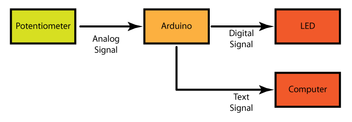

# Many Ways to Blink 1: Potentiometer to LED

This series of tutorials focuses on demonstrating the power of system thinking. We will start with the Potentiometer --> Arduino --> LED system you have seen in the beginning class. We will then switch out the inputs and the outputs and then change the code to adapt the input to the output. Throughout this whole series the system will have the same behavior. This is the input will control the blink rate of the output. To begin with we will go through the code you have seen before. This tutorial will focus on how the code is organized and how to see what the code is doing while it is running. 

#Block Diagram

# Circuit
* Use the Fritzing diagram from the morning class to put this circuit together.

# Code
* Cut and paste the code to a new Arduino sketch. <%= many-ways-to-blink-1.ino =%>
* Save the Sketch as "Many ways to blink 1"
* This tutorial starts with code that has identical functionality as the AnalogIn example. You can see the main changes to the <a href="https://github.com/workshopweekend/many-ways-to-blink-1/blob/master/many-ways-to-blink-1.pdf>code</a> in the link. The main thing that is different this code and the AnalogIn code is that the comments are different and it uses <a href="http://arduino.cc/en/reference/serial">Serial</a>  commands. This makes it easy for us to see what the code is doing and make the code much easier to debug. This also changes the system because it adds a block. The original system was 

and the new system is 

	

* How Serial library works that we first have to say that we are going to use the Serial Port. This is done in the line

	Serial.begin(9600);

The "9600" declares what speed we will communication at. 

* To send messages you use the "Serial.print" and "Serial.println" commands. "Serial.print" sends the message and then leaves the cursor on on the same line. This means that the next messages will be written on the same line as the previous message. "Serial.println" does the same except that it moves the cursor to the beginning of the next line. 
* One good way to do this is shown below.  

	Serial.print("Sensor value: ");  Serial.println(sensorValue);

The is we send then name of the variable and then we send the variable it self and then moves to the next line in the Serial Monitor. Even though these are two separate commands they are shown on the same line to make it easier for a human to read the code. 

* Turn the potentiometer clockwise and counterclockwise and figure out what the maximum and minium values that Sensor Value can have
* Open up the <a href="http://arduino.cc/en/guide/Environment#serialmonitor">Serial Monitor</a> and in the upper left hand corner of the Arduino IDE and see how the information is displayed
* Remove the "ln" from the line

	Serial.print("Sensor value: ");  Serial.println(sensorValue);

* Upload the code again and see how the output changes. You see now that "Sensor Value" and "Delay in millseconds" are now printed on the same line. This is the difference betweeen "Serial.print" and "Serial.println". 
* Put the "ln" back in and upload the code again and confirm you get back to the original behavior. The thing to take away is that you can use "Serial.print" and "Serial.println" to construct easy understood messages. 
* You are done with this tutorial! You can now go on to tutorial 2.
